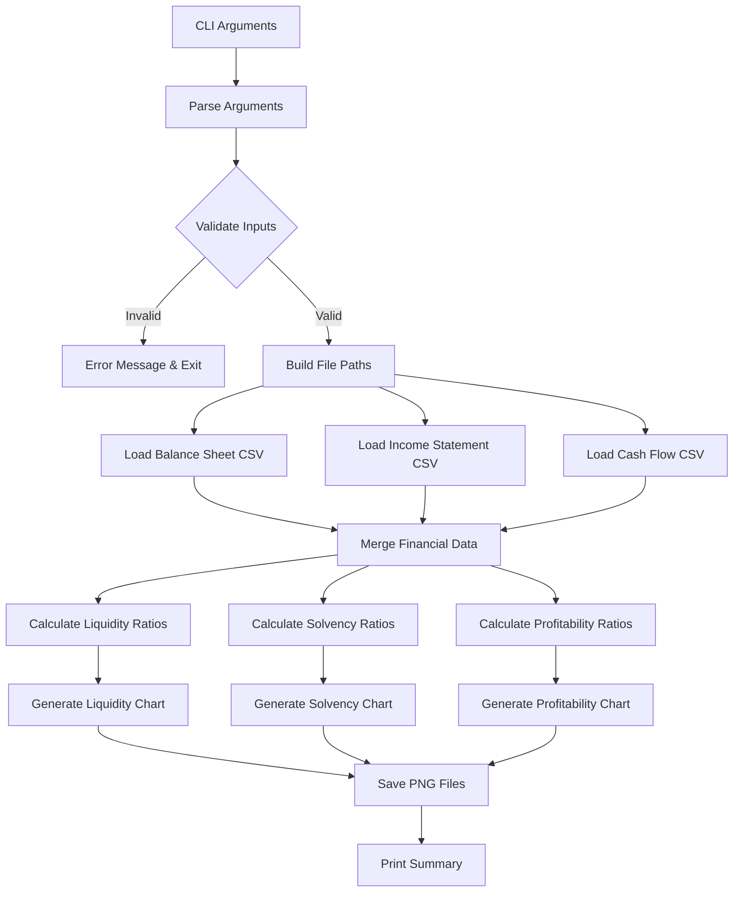

# Ratio Trend Charts CLI Tool - Implementation Plan

## Overview

This document outlines the implementation plan for a Python CLI tool that generates trend charts for financial ratios (liquidity, solvency, and profitability) based on financial statement data from CSV files.

## Requirements Summary

### CLI Arguments
| Argument | Short | Type | Default | Description |
|----------|-------|------|---------|-------------|
| `--ticker` | `-t` | Required | - | Stock ticker symbol (e.g., CSCO) |
| `--directory` | `-d` | Optional | `data` | Custom input/output folder |
| `--quarterly` | `-q` | Flag | False | Use quarterly data instead of annual |
| `--chart-type` | `-c` | Optional | `line` | Chart type: `line` or `bar` |

### Input Files
Based on ticker and period (annual/quarterly):
- `{directory}/{ticker}_balance_sheet_{period}.csv`
- `{directory}/{ticker}_cash_flow_statement_{period}.csv`
- `{directory}/{ticker}_income_statement_{period}.csv`

### Output Files
PNG chart files saved to the input/output directory:
- `{ticker}_liquidity_ratios_{period}.png`
- `{ticker}_solvency_ratios_{period}.png`
- `{ticker}_profitability_ratios_{period}.png`

---

## Financial Ratios to Calculate

### 1. Liquidity Ratios
Measure the company's ability to pay short-term obligations.

| Ratio | Formula | Required Fields |
|-------|---------|-----------------|
| Current Ratio | Current Assets / Current Liabilities | `totalCurrentAssets`, `totalCurrentLiabilities` |
| Quick Ratio | (Current Assets - Inventory) / Current Liabilities | `totalCurrentAssets`, `inventory`, `totalCurrentLiabilities` |
| Cash Ratio | Cash & Equivalents / Current Liabilities | `cashAndCashEquivalents`, `totalCurrentLiabilities` |

### 2. Solvency Ratios
Measure the company's ability to meet long-term obligations.

| Ratio | Formula | Required Fields |
|-------|---------|-----------------|
| Debt-to-Equity | Total Debt / Total Equity | `totalDebt`, `totalStockholdersEquity` |
| Debt-to-Assets | Total Debt / Total Assets | `totalDebt`, `totalAssets` |
| Interest Coverage | EBIT / Interest Expense | `operatingIncome` (EBIT), `interestExpense` |

### 3. Profitability Ratios
Measure the company's ability to generate earnings.

| Ratio | Formula | Required Fields |
|-------|---------|-----------------|
| ROE (Return on Equity) | Net Income / Average Shareholders Equity | `netIncome`, `totalStockholdersEquity` |
| ROA (Return on Assets) | Net Income / Average Total Assets | `netIncome`, `totalAssets` |
| Gross Margin | Gross Profit / Revenue | `grossProfit`, `revenue` |
| Operating Margin | Operating Income / Revenue | `operatingIncome`, `revenue` |
| Net Margin | Net Income / Revenue | `netIncome`, `revenue` |

---

## Architecture

```
ratio_trend_charts.py (Main CLI Entry Point)
├── cli_parser.py (Argument Parsing)
├── data_loader.py (CSV Loading & Validation)
├── ratio_calculator.py (Ratio Computation)
│   ├── liquidity_ratios()
│   ├── solvency_ratios()
│   └── profitability_ratios()
└── chart_generator.py (Matplotlib Visualization)
    ├── generate_line_chart()
    └── generate_bar_chart()
```

### Single-File Alternative
For simplicity, all modules can be combined into a single `ratio_trend_charts.py` file with clearly separated sections.

---

## Implementation Plan - Atomic Subtasks

### Phase 1: Project Setup
- [ ] **1.1** Create `ratio_trend_charts.py` file with module docstring and imports
- [ ] **1.2** Define constants for ratio names and default values
- [ ] **1.3** Ensure `data/` directory structure is documented

### Phase 2: CLI Argument Parser
- [ ] **2.1** Create `argparse.ArgumentParser` with program description
- [ ] **2.2** Add `-t/--ticker` required argument (type: str)
- [ ] **2.3** Add `-d/--directory` optional argument (default: "data")
- [ ] **2.4** Add `-q/--quarterly` flag (action: store_true)
- [ ] **2.5** Add `-c/--chart-type` optional argument (choices: line, bar; default: line)
- [ ] **2.6** Add `--help` examples in epilog

### Phase 3: Data Loading Module
- [ ] **3.1** Create `load_csv()` function to read CSV into pandas DataFrame
- [ ] **3.2** Create `build_file_paths()` function to construct input file paths
- [ ] **3.3** Add file existence validation with clear error messages
- [ ] **3.4** Create `load_financial_data()` function to load all three statements
- [ ] **3.5** Add column name normalization (handle FMP field naming conventions)
- [ ] **3.6** Sort data by date (ascending) for proper trend visualization

### Phase 4: Liquidity Ratio Calculator
- [ ] **4.1** Create `calculate_current_ratio()` function
- [ ] **4.2** Create `calculate_quick_ratio()` function
- [ ] **4.3** Create `calculate_cash_ratio()` function
- [ ] **4.4** Create `calculate_liquidity_ratios()` wrapper function returning DataFrame
- [ ] **4.5** Add handling for missing/zero values (return NaN, not error)

### Phase 5: Solvency Ratio Calculator
- [ ] **5.1** Create `calculate_debt_to_equity()` function
- [ ] **5.2** Create `calculate_debt_to_assets()` function
- [ ] **5.3** Create `calculate_interest_coverage()` function
- [ ] **5.4** Create `calculate_solvency_ratios()` wrapper function returning DataFrame
- [ ] **5.5** Add handling for division by zero (return NaN)

### Phase 6: Profitability Ratio Calculator
- [ ] **6.1** Create `calculate_roe()` function
- [ ] **6.2** Create `calculate_roa()` function
- [ ] **6.3** Create `calculate_gross_margin()` function
- [ ] **6.4** Create `calculate_operating_margin()` function
- [ ] **6.5** Create `calculate_net_margin()` function
- [ ] **6.6** Create `calculate_profitability_ratios()` wrapper function returning DataFrame
- [ ] **6.7** Add handling for missing/zero revenue values

### Phase 7: Chart Generation Module
- [ ] **7.1** Create `setup_chart_style()` function for consistent styling
- [ ] **7.2** Create `generate_line_chart()` function with multi-line support
- [ ] **7.3** Create `generate_bar_chart()` function with grouped bars
- [ ] **7.4** Add legend, title, axis labels, and grid
- [ ] **7.5** Create `save_chart()` function to export PNG with proper DPI
- [ ] **7.6** Create `generate_ratio_chart()` dispatcher based on chart type

### Phase 8: Main Orchestration
- [ ] **8.1** Create `main()` function to orchestrate the workflow
- [ ] **8.2** Parse CLI arguments
- [ ] **8.3** Determine period string (annual/quarterly)
- [ ] **8.4** Load financial statement data
- [ ] **8.5** Calculate all three ratio categories
- [ ] **8.6** Generate and save liquidity chart
- [ ] **8.7** Generate and save solvency chart
- [ ] **8.8** Generate and save profitability chart
- [ ] **8.9** Print summary of generated files

### Phase 9: Error Handling & Validation
- [ ] **9.1** Add try/except blocks around file operations
- [ ] **9.2** Validate ticker format (alphanumeric, uppercase)
- [ ] **9.3** Validate directory exists or create it
- [ ] **9.4** Add informative error messages for missing CSV columns
- [ ] **9.5** Add warning messages for periods with missing data

### Phase 10: Documentation & Testing
- [ ] **10.1** Add module docstring with usage examples
- [ ] **10.2** Add docstrings to all functions
- [ ] **10.3** Create README section for ratio_trend_charts.py
- [ ] **10.4** Create sample test data (mock CSVs)
- [ ] **10.5** Write unit tests for ratio calculation functions
- [ ] **10.6** Write integration test for end-to-end workflow

---

## Data Flow Diagram



---

## Expected CSV Column Mappings

Based on FMP API response format, expected columns in CSV files:

### Balance Sheet (`{ticker}_balance_sheet_{period}.csv`)
```
date, totalCurrentAssets, totalCurrentLiabilities, inventory, 
cashAndCashEquivalents, totalDebt, totalStockholdersEquity, totalAssets
```

### Income Statement (`{ticker}_income_statement_{period}.csv`)
```
date, revenue, grossProfit, operatingIncome, netIncome, interestExpense
```

### Cash Flow Statement (`{ticker}_cash_flow_statement_{period}.csv`)
```
date, operatingCashFlow, capitalExpenditure, freeCashFlow
```

---

## Sample Usage

```bash
# Basic usage with annual data
python ratio_trend_charts.py -t CSCO

# Use quarterly data
python ratio_trend_charts.py -t CSCO -q

# Custom directory with bar charts
python ratio_trend_charts.py -t CSCO -d ./my_data -c bar

# Full example with all options
python ratio_trend_charts.py --ticker AAPL --directory ./financial_data --quarterly --chart-type line
```

---

## Dependencies

```
pandas>=1.3.0       # Data manipulation
matplotlib>=3.4.0   # Chart generation
argparse            # CLI argument parsing (standard library)
```

---

## Implementation Notes

1. **Error Handling**: Use graceful degradation - if a ratio cannot be calculated due to missing data, show NaN in the output rather than failing the entire script.

2. **Chart Styling**: Use a consistent professional style suitable for financial analysis (clean gridlines, appropriate colors for each ratio).

3. **Date Handling**: Parse dates from CSV and format appropriately on x-axis (e.g., "2023", "Q1 2023").

4. **Percentage Ratios**: Convert margin ratios to percentages (multiply by 100) for better readability.

5. **Legend Placement**: Position legend outside the plot area to avoid obscuring data.

---

## Success Criteria

- [ ] CLI accepts all specified arguments with proper validation
- [ ] All 11 ratios are calculated correctly from raw financial statement data
- [ ] Three PNG charts are generated per run (liquidity, solvency, profitability)
- [ ] Both line and bar chart types work correctly
- [ ] Script handles missing data gracefully without crashing
- [ ] Output files are saved to the correct directory with proper naming
- [ ] Code follows existing project patterns (similar to fmp_fetcher.py style)
